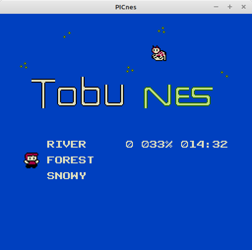
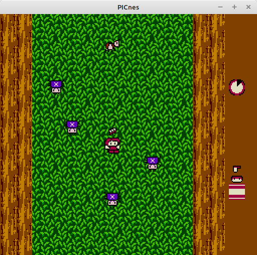
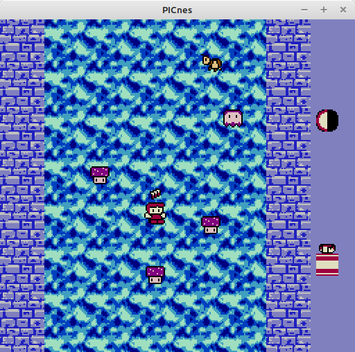

<b><h1>TobuNES</h1></b>

This is a port of "Tobu Tobu Girl" for the NES.  Links to the original game can be found on <a href="https://github.com/SimonLarsen/tobutobugirl-dx">GitHub</a> and <a href="https://tangramgames.itch.io/tobu-tobu-girl-deluxe">Itch-IO</a>. 

All art assets are created by me, or were found on <a href="https://opengameart.org/">OpenGameArt</a> and were CC0 (aka Public Domain). 

To assemble the code, I am using Loopy's "asm6", found on <a href="https://www.nesdev.org/wiki/Tools">NesDev Tools</a>.  The included Combiner and Converter are what I use after the assembler to compile the ROM.  I use my own <a href="https://github.com/stevenchadburrow/PICnes">PICnes Emulator</a> for testing.  

<b>Controls:</b> 
- A = Forward (in menu), Dash and Stomp (in play) 
- B = Forward (in menu), Fly (in play) 
- Start = Go Back 
- Select = Change Character 

<b>To Do List:</b> 
- Music and Sound Effects 
- Computed Grade 
- Better Artwork 
- Better 'Story' Scene 

<b>Pictures:</b> 
 
 
 

